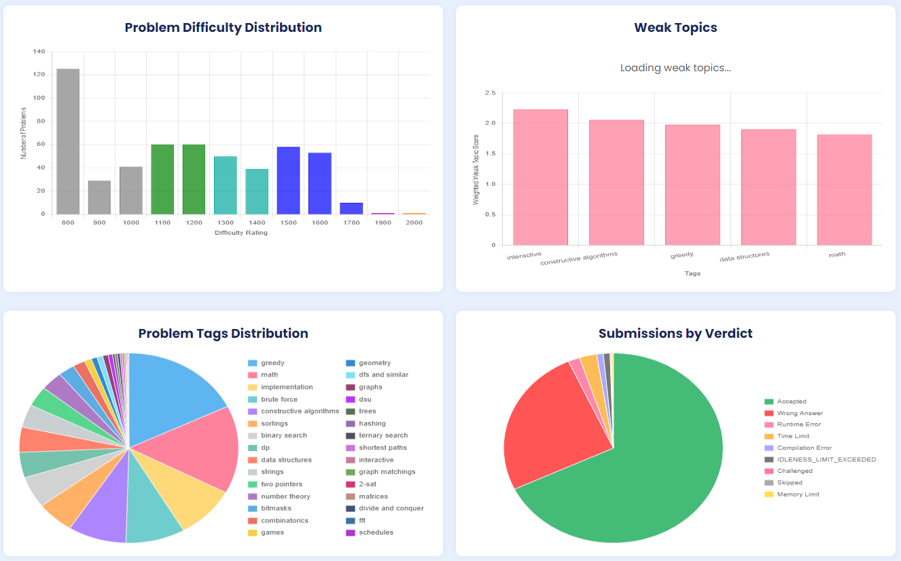
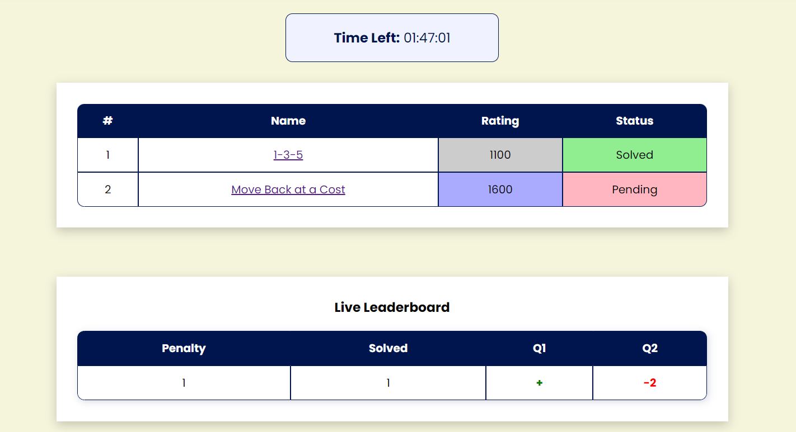

**Competitive Programming Arena**

**Overview**

Develop a web-based Competitive Programming Arena where users can create and participate in custom individual contests, track their performance, and engage in problem-solving. Additionally, users can add friends and compare their performance with them. The platform integrates with the Codeforces API for problem redirection, submission tracking, and leaderboard generation.

**Features Implemented**

- **User Authentication**

  Secure login and sign-up with an option to sign up or log in using Google.

- **User-Dashboard** 

  The **User Dashboard** provides a comprehensive overview of a user's performance on Codeforces, helping them track progress and identify weak areas. It includes:

  - **Rating History**: A graphical representation of the user's **Codeforces rating changes over time**.
  - **Current & Max Rating/Rank**: Displays the user's **current rating and rank**, along with their **highest-ever rating and rank**.
  - **Total Problems Solved**: Displays the number of problems solved.
  - **Problem Difficulty Distribution**: A **bar chart** showing the number of problems solved at different difficulty levels (rating vs. problem count).
  - **Weak Topics Analysis**:  Weak topics tags are calculated using the weighted formula:

W: Wrong Submissions
 
T: Total Submissions

- A **pie chart** visualizes the user's problem attempts based on different tags.
- **Verdict Distribution**: Another **pie chart** categorizing problem attempts by verdicts (Accepted, Wrong Answer, Time Limit Exceeded, etc.).
- **Daily Activity Heatmap**: Tracks the **user’s problem-solving streak**, helping them stay consistent.
- **Recent Contests**: Displays details of the **latest contests** the user participated in, including performance metrics.

- **User Profile**

  The User Profile section provides users with a personalized experience, allowing them to manage their information, track their contest history, and connect with friends. It includes:

  - **Profile Section**: Displays user details such as **name, email ID, and other basic information**.
  - **Edit Profile**: Allows users to **update their profile details** as needed.
  - **Connect Codeforces**: Users can **link their Codeforces handle**, enabling integration with Codeforces for performance tracking.

  

- **All Problems & Weak Topic Problem Set** 
  - The platform provides a comprehensive **All Problems** section, where users can access a wide range of coding problems. Users can filter these problems based on rating (difficulty range), tags (such as DP, Graphs, and Greedy), and status (solved/unsolved). Additionally, a refresh button allows users to update the problem status dynamically.
  - Alongside this, the **Weak Topic Problem Set** focuses on areas where users need improvement. It curates problems based on weak topics identified from past performance. Here users can filter problems by rating and Status. A refresh button ensures that the problem set remains updated with the latest progress and weak areas.

- **Contest Creation & Management**

  Users can create private contests, set durations, and select problems (redirected to Codeforces for submission and evaluation), while viewing solved status using the refresh button to sync with Codeforces.

- **Automated Scoring & Live Leaderboard** 

  Real-time leaderboard with an ICPC-style penalty system based on Codeforces verdicts.

- **Contest History** 

  Users can view their past contests attempted on our site under profile page, including links to contests, penalty details (based on the ICPC-style penalty system), and a virtual rating graph to track progress over time.

- **Friends Section**

  Users can add friends to their friend list and compare their performance in any specific contest that is common to both under profile section.

- **Upcoming Contest**

  Displays a list of upcoming contests on contest page with their date, start time, and a direct link to register on Codeforces.

**Hosted Link**

[***https://byte-code.onrender.com***](https://byte-code.onrender.com)

**Tech Stacks**

- **Frontend**: HTML, CSS, JavaScript
- **Backend**: Node.js, Express.js
- **Database**: MongoDB
- **API** **Integration**: Codeforces API

